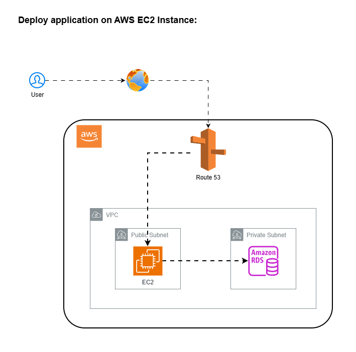
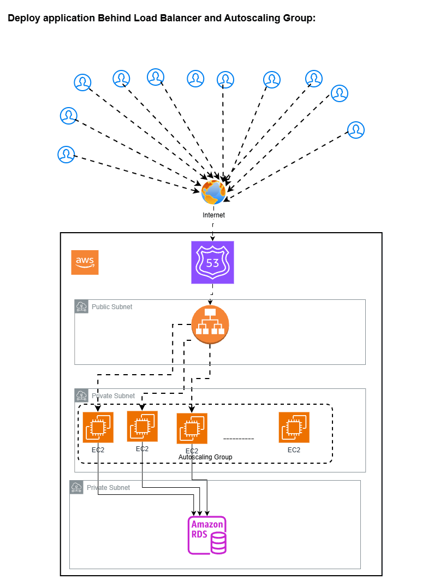
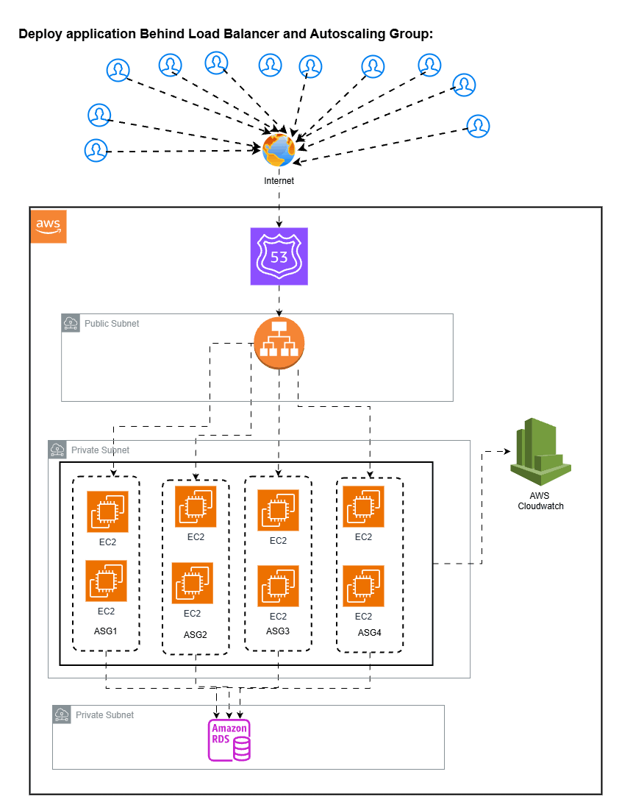

> *A comprehensive guide to understanding why kubernetes required and which all type of EC2 problems overcome using kubernetes.*

---

# 🚀 From EC2 Chaos to Kubernetes Calm
### Real-World Problems with Deploying on AWS EC2 — and How Kubernetes Fixes Them

> Running applications on raw EC2 instances feels manageable at first — until traffic spikes at 2 AM, a server silently dies, or your team can't deploy without downtime. This blog walks through real problems engineers face daily on EC2 and explains exactly how Kubernetes solves each one.

---
### 1. Deploy application on single EC2 instance

Imagine you're the backend engineer at a fast-growing startup. You get the instruction:

> *"We need to deploy our ecommerce app (created on Node.js language). Just spin up an EC2 instance, it's simple."*

What you will do in that case, you will do the following steps:
1. Create the new EC2 instance
2. Pull the latest code from SCM tool (like Github, bitbucket)
3. Install the application dependances 
4. Run the application.
5. Attach elastic ip to EC2 instance
6. Map EC2 elastic ip with Domain Name in DNS records (for example in route 53 ) 

This is the normal setup for any application deployment. 

> You're live. Everyone's happy. Then... the users come.



#### Problem in this setup:
1. **Single point of failure:**
    - if instance crash -> entire site is down
    - if OS hands / Disk fills -> checkout stops
    - If you reboot for updates -> application  Downtime

> There is no backup instance to take the traffic

2. **No High availability:** 
    - No redundancy across AZs
    - No failover 
    - Any issue = full outage

3. **Scaling Limits:**
    - Single machine has fixed capacity
    - traffic spikes ( sales/festivals) -> app slows, crashes
    - You can only scale vertically ( increase CPU and RAM of instance) which require restart, has some limits

4. **Risky Deployments:**
    - to deploy application you need to stop the app, pull the code and then run / deploy the app. 
    - It will take the application deployment. 
    - if deployment failed then site is broken
    - rollback (deploy or run to previous version) is manual

5. **No isolation:**
    - if bug in one module, entire application down.
    - if memory leak happens then it kills entire system

6. **Matainance pain:**
    - if OS patching required then it required reboot and downtime of application
    - if need to update security patches then need downtime.
  -  Require Disk cleanup (remove unwanted data) then it is risky

7. **Poor user experience under load:**
    - During spikes, pages load slowly
    - if CPU is high then failed payments
    - Timeout error happens in the middle of any process of application

#### Solution:
You will overcome some of the above problems by using following steps:
1. Create the AMI from the same Instance and Deploy new instance
2. Do your work ( like, application deployment, server patching, security updates, Disk cleanup)
3. Remove the elastic ip from older instance and attach to new instance, it will take some application downtime. but it will not overcome all above problems. 

> To overcome all the issues, you need to run the application behind load balancer and autoscaling groups. each setup has its own pros and cons, you have to decide, which setup is required on what condition.

> I would suggest to use this setup only for devlopement purpose where application downtime not  required and if anything happend to application or infra then it will not affect any production setup or your company business.
---
### 2. Deploy EC2 application on EC2 instances behind application load balancer with Auto-scaling groups

**Problem:** Your e-commerce app runs on a single `t3.medium` EC2 instance. You launch a flash sale — 50,000 users flood in within 10 minutes. CPU hits 100%. Response times go from 200ms → 30 seconds → timeouts. Users can't checkout. You lose ₹40 lakhs in revenue.

You scramble to spin up more EC2s manually. By the time new instances are ready (AMI creation, launch, health checks — ~15 minutes), the sale peak is over.

To avoid this, you have created Application load balancer with Autoscaling groups and put the EC2 instance behind this setup with multiple copies of same ec2 instances to hadle the traffic. It will work but below problems occurs when you new application scales and user traffic grows continously.



But every setup has its pro's and con's. 

We will overcome problems of setup 1 (Deploy application on single AWS EC2 Instance).

#### **Pro's**:
1. **High Availability:** Multiple instances across AZ's so if one AZ's Fails then traffic shif automatically to another ec2 instances

2. **Automatic Recovery:** If unhealthy instance found then autoscaling group automatically remove unhealthy instance and create new one. No manual intervention need to do this
3. **Horizontal Scaling:** We cannot do Horizontal scaling in setup 1 but here when traffic increases the ASG will add the instances. It handles traffic spikes better than single EC2 Instance
4. **Simple Structure:** It is easy to understand. Easy to debug compared to kubernetes
5. **Cost Control:** No cluster overhead. Pay per EC2 usage

> Each setup has its con's. Lets discuss what it is?

#### **Con's:**

1. **slow Scaling:** when new instance is created automatically in autoscaling group then it will take 1 to 3 minute time to up. During spike, user may face latency/ errors

2. **Instance level Healing only:** if app inside EC2 instance crashed then whole EC2 instance will be replaced. No partial recovery in this case. You can use systemmd restart policies but it has some limitations.

3. **Deployment complexity:** To do the deployment, you need to do manually or require some custom scripts. You need to delete all previous ec2 instances and create new one. It will take lots of time. if new application version inside new instances is not working properly then to do the rollback (deploy previous version) also takes time. To fix this, you can create new ASG and create the new ec2 instances with new changes in application and redirect traffic from old ASG to new ASG. It will take lots of manual work or require some automation scripts.

4. **Resource waste:** Each instance run full application. if app is using minimum compute memory then its a waste of resource (CPU and RAM)

5. **Limited Scaling Granularity:** Scale entire instance, not specific component.

6. **Configuaration drift:** Over time, Instances may differ (manual changes, patching)

7. **Observalibility Gaps:** it is hard to debug distributed issues.

8. **Cost at Scale:** Idle instances still cost money. Overprovisioning for safety occur large amount of cost.

> Till Now, we are using single monolithic application in autoscaling groups behind the application load balancer. 

> No need Jump Directly to K8s Immediately.

> What we achived In this Setup

1. Zero Downtime by using creating new ALB and if deployment works fine then switch real user traffic to New Autoscaling Group
2. By using better healthcheck, we can reduce the application downtime.
3. Using cloudwatch, we can achive the obervalibility

> Upgrade Path

1. Use better healthchecks
2. We can use microservice based architecture behind ALB + Autoscaling group
3. Multiple ASG's per service
4. Internal Load Balancing for service.


### 3. Deploy Mutiple microservices of an aplication on EC2 instances behind application load balancer with Auto-scaling groups



#### What your setup already solves:

1. **Service Isolation** Failure in Service A will not crash service B. Independant Scaling Per service
2. **Better Scalability than Monolithic:** Each microservice scales based on its own Load. No need to scale entire application
3. **Fault isolation at instance level:** If instance in Service A fails then only that service impacted. ASG replaces it automatically
4. **Clear ownership model:** each service has its own deployment pipeline. each service has its own scaling policy
5. **Simpler than Kubernetes:** Easier debugging. Less operational overhead initially


#### Problems you will face (this is where reality hits)

1. **Resource fragmentation (huge cost issue)** Each service has its own EC2 fleet. You cannot share unused capacity, result is wasted CPU/RAM, Higher AWS Bill
 
    ```bash
    Service A → 20% usage
    Service B → 30% usage
    Service C → 10% usage
    ```
2. **Slow scaling (minutes vs seconds):** ASG launches EC2. it will takes 1–3 minutes. During spike → latency / errors

3. **Instance-level healing only:** Even with /healthcheck, if service partially failed then either ignore or kill the whole EC2

4. **Deployment complexity (big pain at scale):** With 10 services: 10 pipelines, 10 rolling deployments, Hard rollbacks. Risk of downtime and inconsistency
5. **Operational overhead explosion:** 10 ASG, 10 launch templates, 10 scaling configs, 10 health checks, it Becomes hard to maintain
6. **Minimum capacity problem:** Each service need atleast 2 EC2 Instances for High availability. so 10 microservices need atleast 20 instances minimum. evenif traffic is slow


> When this setup is perfect

1. 5–10 services only
2. Moderate traffic
3. Low deployment frequency
4. Cost is acceptable
5. Small team

> When Kubernetes becomes necessary
1. Services grow (10 → 30 → 100)
2. High traffic spikes
3. Frequent deployments (daily/hourly)
4. Rising AWS cost due to idle capacity
5. Operational complexity becomes hard


